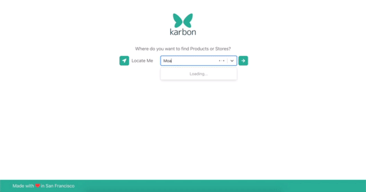

    

    <h2>Welcome to Karbon-Scraper!</h2>
    <a href="https://karbon-web.dev.novichkov.dev">Live Project Link 🔗 </a>

 

This part of the bigger Karbon project is a web scraper written in GO that gets inventory of local stores like CVS, Ace, Safeway (more coming...), in order to populate the Elastic Search database which powers the core functionality of Karbon Web and the Karbon extension. This gives the app real inventory to show users that are looking for products in nearby locations. This is an ongoing effort to populate more and more products from stores in the East Bay, which is going to be the launch location. 

